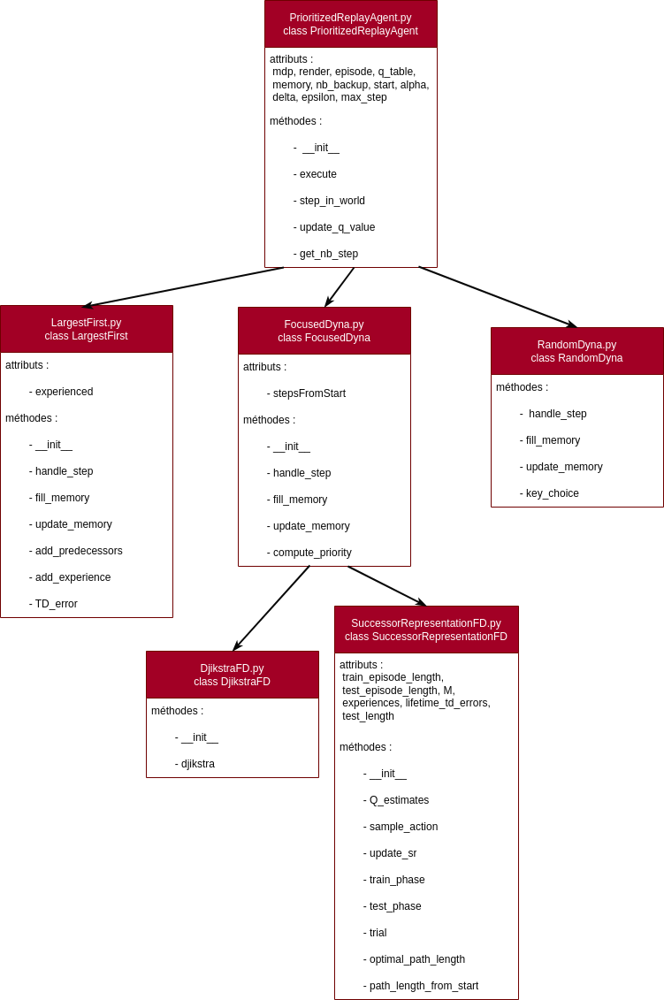

# Activation priorisée des souvenirs pour l'apprentissage par renforcement
## Résumé 
L'objet du projet est de s'inspirer finement des propriétés d'un modèle de neurosciences computationnelles pour construire un algorithme d'apprentissage par renforcement performant.
## Références
Les articles principaux :
- Prioritized memory access explains planning and hippocampal replay | MG , ND Daw - Nature Neuroscience, 2018 | [Pdf](https://www.biorxiv.org/content/biorxiv/early/2018/05/20/225664.full.pdf)

- Efficient Learning and Planning within the Dyna Framework | Jing Peng, Ronald J. Williams, Adaptive Behavior, 1(4):437-454, 1993 | [pdf](https://citeseerx.ist.psu.edu/document?repid=rep1&type=pdf&doi=c5fc10768d83ba42a360d861eb96d79fec5d52f4)

- Prioritized experience replay | Schaul, T., Quan, J., Antonoglou, I., & Silver, D. arXiv preprint arXiv:1511.05952, 2015 | [pdf](https://arxiv.org/pdf/1511.05952.pdf)

- [Le dépôt des étudiants de l’an dernier](https://github.com/GabyRkt/Prioritized-Memory-Access)

Diagramme de structure de code : 
 